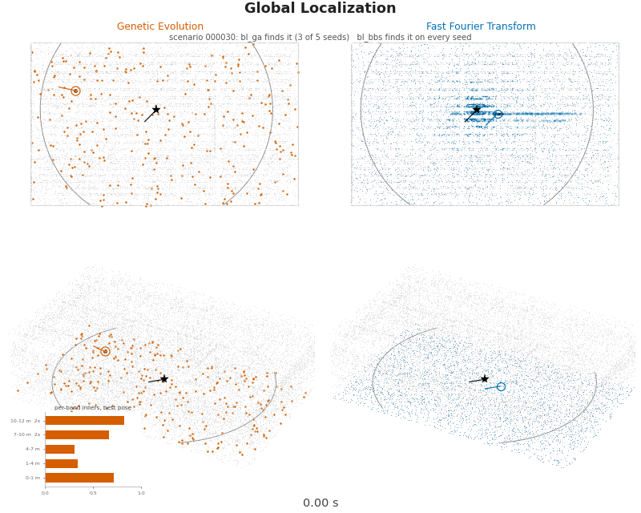
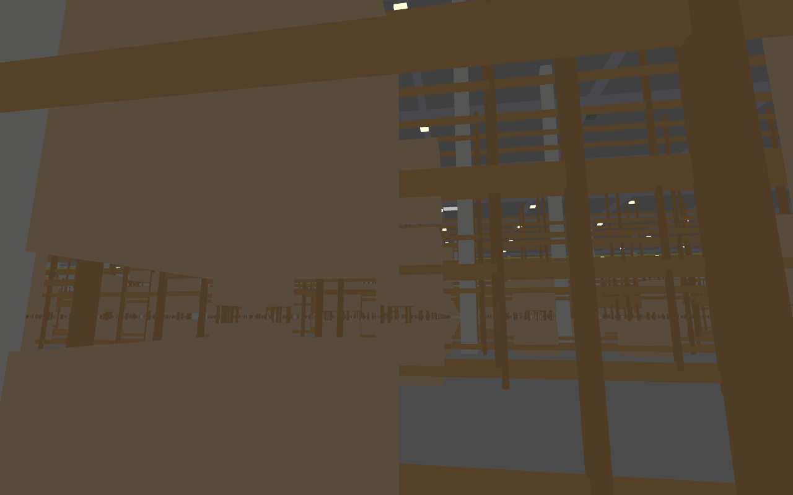
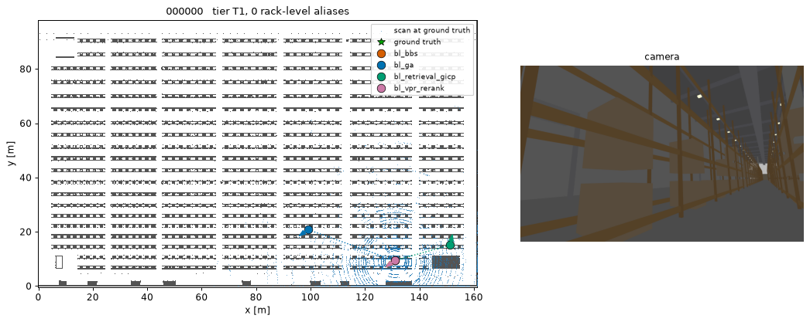
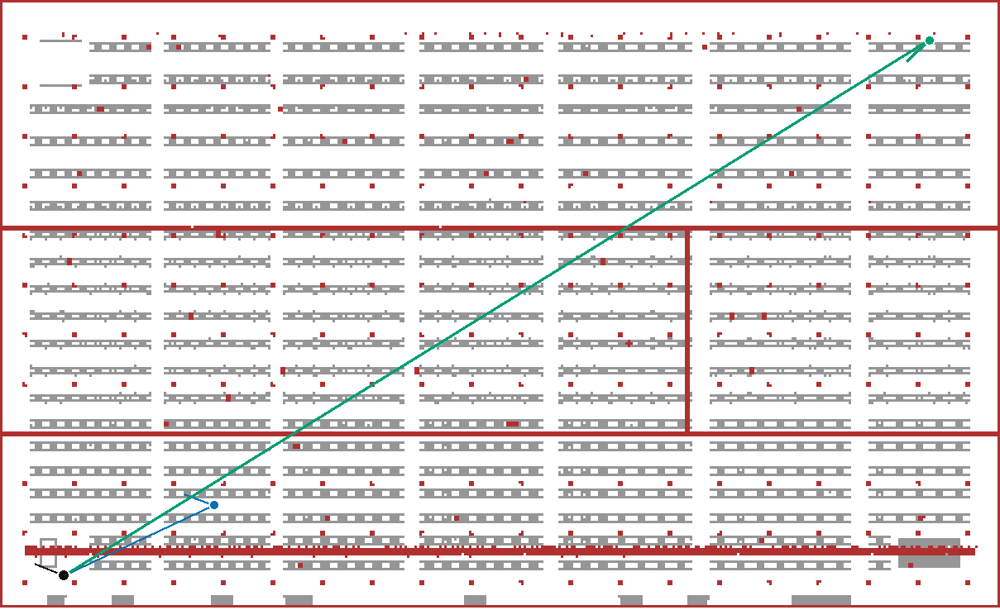
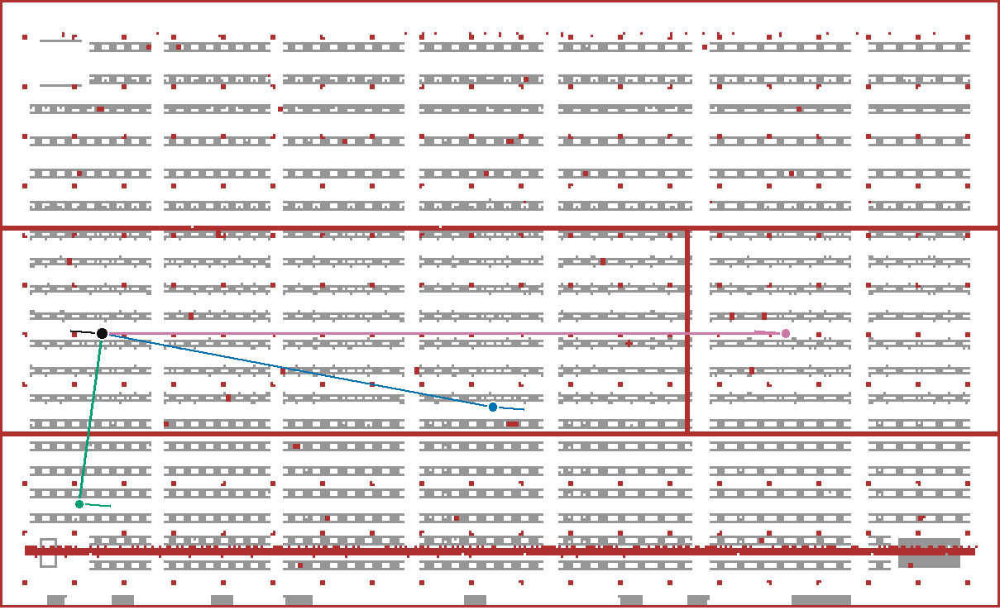
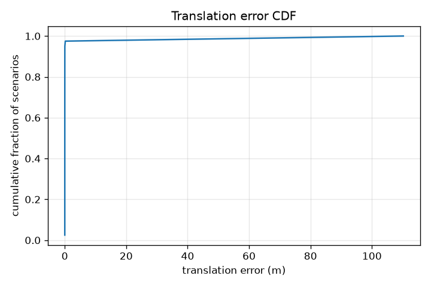
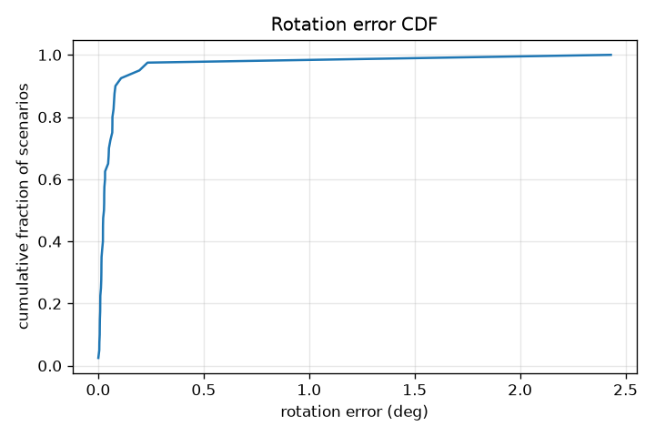
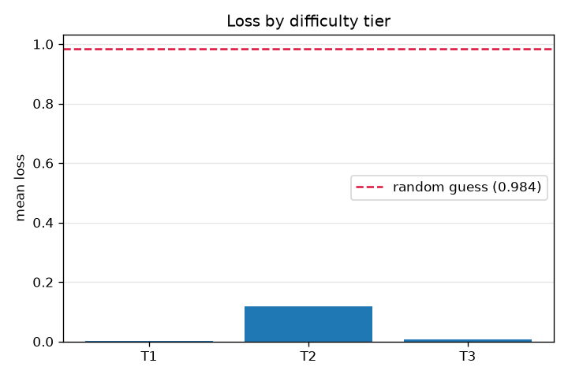

# Baselines

Four reference methods ship with the challenge. This page says what each one
does, how it scores on the released dev split, and what the failures look
like. Numbers come from `eval/score.py`, the same scorer used for the
official evaluation.

## What each baseline does

### Multi-slice bird's-eye-view correlative search (`bl_bbs`)

Flattens the scan and the prior map into five horizontal height bands, then
searches every east/north/heading placement exhaustively by fast Fourier
transform cross-correlation, weighting the two ceiling bands twice as
heavily. Refines the winning placement with point-to-plane iterative closest
point.

Exhaustive search is what makes it work. In a repetitive warehouse the
scoring surface has thousands of near-equal peaks, and any method that
samples or summarizes can settle on a good-enough peak instead of the right
one. Evaluating every placement and taking the global maximum is the only
approach here that reliably finds the true one.

### Polar-histogram retrieval with geometric refinement (`bl_retrieval_gicp`)

Builds a database of candidate viewpoints sampled every 2 metres from the
prior map and retrieves by a rotation-invariant ring descriptor, recovering
heading by circular cross-correlation and refining with generalized
iterative closest point. Cost scales with database size rather than with map
area.

### Evolutionary pose search (`bl_ga`)

Scatters a population of random ground-plane guesses, scores each by how much
of the scan it explains, and mutates the survivors over successive
generations. Pays only for the placements it samples, and submits its
surviving modes as up to three hypotheses.

### Camera edge re-ranking (`bl_vpr_rerank`)

Re-orders and re-weights a pose hypothesis set produced elsewhere, by
projecting the prior map's geometry into the camera and scoring edge
agreement against the captured image. It cannot localize on its own, and it
cannot change anything when it is handed a single hypothesis.

## Results on the dev split

Track A, 40 scenarios. `S-fine` is 0.5 m and 5 degrees; `S-coarse` is 2.0 m
and 10 degrees. Compute is reported beside the score and never folded into
it. `bl_vpr_rerank` writes no compute sidecar, so its cost is not recorded.

| method | score | SR@fine | SR@coarse | oracle@fine | mean loss | sec/scenario | peak RSS (MB) |
| --- | --- | --- | --- | --- | --- | --- | --- |
| `bl_bbs` | 97.74 | 0.975 | 0.975 | 0.975 | 0.0226 | 2.65 | 1100 |
| `bl_vpr_rerank` | 97.74 | 0.975 | 0.975 | 0.975 | 0.0226 | not recorded | not recorded |
| `bl_ga` | 22.36 | 0.025 | 0.025 | 0.025 | 0.7764 | 10.27 | 1100 |
| `bl_retrieval_gicp` | 7.63 | 0.000 | 0.000 | 0.000 | 0.9237 | 23.27 | 1218 |
| random guess | 1.64 | - | - | - | 0.9836 | - | - |

With 40 scenarios a success rate can only land on multiples of 0.025, so a
gap of one scenario is not a difference between methods.

`bl_vpr_rerank` ties `bl_bbs` because it was handed `bl_bbs` output, which
carries one hypothesis per scenario. A list of one cannot be reordered, and a
single weight must normalize to 1.0, so it returned its input unchanged. To
exercise it, feed it a method that emits several hypotheses.

`oracle@fine` equal to `SR@fine` on every row means no method's alternative
hypotheses were better than its primary, so there is currently no re-ranking
headroom anywhere in this set.

## Per-tier breakdown

Tiers come from a measured alias count: T1 has none, T2 at most three, T3
more.

| method | T1 (n=9) | T2 (n=8) | T3 (n=23) |
| --- | --- | --- | --- |
| `bl_bbs` | 99.76 | 90.99 | 99.30 |
| `bl_vpr_rerank` | 99.76 | 90.99 | 99.30 |
| `bl_ga` | 34.15 | 14.88 | 20.34 |
| `bl_retrieval_gicp` | 6.63 | 7.44 | 8.08 |

The ordering is not monotonic: T3 is supposed to be hardest, yet `bl_bbs`
scores perfectly on it and drops only on T2. The alias counter thresholds
peaks at 0.9 times the ground-truth score, a relative bar, so a scenario with
weak geometry clears it easily and one with strong geometry does not. Treat
the tier column as descriptive, not as a difficulty ranking.

## How the two searches differ

The tables above say which baseline wins. They do not show what either one
does. `tools/render_search_animation.py` writes an animation that does, on
synthetic geometry it generates itself, so it reproduces from a clean
checkout with no map and no scenarios. Both panels run the real searches:
the left is `bl_ga`'s own population loop, genetic operators and fitness
function, the right is the exhaustive Fourier correlation from
`baselines/common/bev.py` with band edges from `bl_bbs.build_slice_bands`.

Both methods search east, north and heading with height pinned at the rig's
1.0 metre mount. `bl_ga`'s three-dimensional scoring is a property of its
fitness function, not of its search space, so every pose in both panels sits
on the floor plane.

Racking is grey and walls, columns and roof structure are pale red, as in the
report's scenario map. The truth is a black star, `bl_ga` is orange and
`bl_bbs` is blue. Each panel carries one inset. On the left it is a 20 metre
plan view around the truth, because a two metre error is a handful of pixels
at hall scale. On the right it is the set of placements still scoring within
ten per cent of the best, which is the quantity that has to collapse to one
before the search has decided anything. Height is drawn four times
exaggerated; everything horizontal is to scale.



Three differences, measured on this synthetic 160 by 93 metre hall:

- **Coverage.** `bl_bbs` scores all 28,569,600 placements, a 640 by 372 grid
  of quarter-metre cells at 120 headings, and still finishes in less
  wall-clock time than `bl_ga` (2.65 against 10.27 seconds per scenario
  above), because one Fourier transform prices an entire translation grid at
  once. `bl_ga` scores 12,300 poses, 2,323 times fewer. Its 300 opening
  samples work out at 49.6 square metres each, a 7.0 metre grid-equivalent
  spacing, coarser than the 5 metre rack row pitch it has to resolve.
- **Height.** `bl_bbs` cuts both clouds into five bands and weights the top
  two, which is everything above the racking, twice as heavily. `bl_ga`, as
  of commit `99dcfdc`, treats all heights alike.
- **Evidence.** `bl_bbs` demeans the map grid before correlating, so empty
  cells score negative and a near-solid surface contributes nothing: the
  floor band is fully occupied here, and its score surface is identically
  zero. `bl_ga`, as of commit `99dcfdc`, scores a raw inlier fraction, which
  is exactly the un-demeaned overlap that demeaning exists to remove. Across
  the 300 uniformly random poses this run opens with, the mean inlier
  fraction is already 0.618: a pose picked at random explains 62 per cent of
  the scan.

The last two points are stated as of a commit on purpose. They describe
`bl_ga`'s fitness function, which is a thing that can change, and a claim
phrased as timeless would go stale without anything failing. If that
fitness changes, re-render the animation and revise those two points;
`--verify` prints the fitness definition the figure actually scored, so the
drift shows up rather than passing silently.

In the run shown, `bl_bbs` lands one quarter-metre cell from the truth
before its refinement step. `bl_ga` converges with a 0.988 inlier fraction,
against 1.000 at the truth, on a pose 2.07 metres away: the right aisle, the
wrong place along it. Three of its modes survive the separation filter and
one clears the confidence filter, and `oracle@fine` equal to `SR@fine` above
says the alternates would not have held the answer anyway.

The animation shows the ceiling weighting and it shows the demeaning, but it
is not evidence that either one is why `bl_bbs` wins. The attribution above
stands: evaluating every placement is what makes it work.

```bash
python tools/render_search_animation.py --out docs/images/search_ga_vs_slices.gif
python tools/render_search_animation.py --verify   # the numbers above, no render
```

## What a scenario looks like

Each scenario is one lidar scan, one camera image, and calibration. The
camera sees the racking, the aisle receding, and the ceiling structure.



The per-scenario figure pairs a top-down view of the prior map, the truth,
and each submitted pose with that scenario's camera frame.



## What the report looks like

`eval/score.py` writes a self-contained HTML report next to the scores. It
carries the summary and per-tier tables, a casewise matrix, and a scenario
map you can page through. The map is inline vector geometry rather than
rendered images, so the whole report is one file that opens offline.

Racking is grey, structural columns and walls and landmarks are dark red,
the truth is black, and each method gets a colour with a line drawn back to
the truth.

Scenario 000038, where the two working methods sit on the truth while the
other two are 26.7 m and 164.1 m away:



Scenario 000014, the only one `bl_bbs` misses. Its estimate has the same
northing to within 3 mm and the same heading to within 0.06 degrees, but sits
110.2 m along the aisle on an identical-looking bay. This is what rack-level
aliasing looks like when it beats an otherwise exact matcher:



## Score distributions

Translation error, cumulative over scenarios:



Rotation error, cumulative over scenarios:



Loss by tier:



## Reproducing

```bash
python baselines/bl_bbs/run.py --scenarios scenarios/dev/A \
    --map map/prior_map.pcd --out submission.txt --workers 0

python eval/score.py --submission submission.txt \
    --gt scenarios/dev/gt/A.txt --track A --out-dir results \
    --map map/prior_map.pcd
```

Passing `--map` builds the vector background the scenario map needs. Without
it the report still renders, just without the map section.
